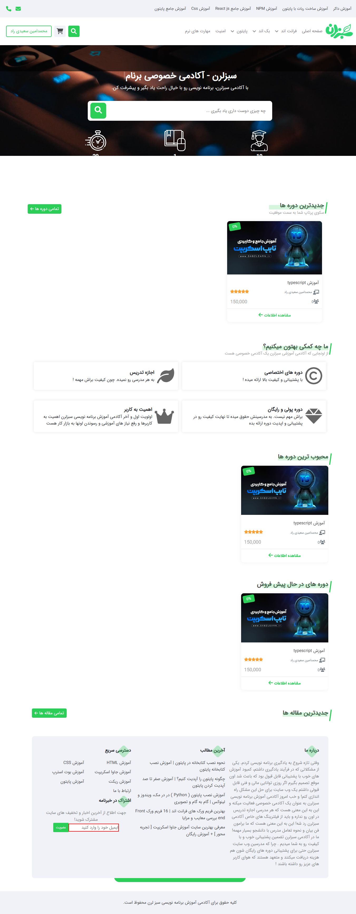
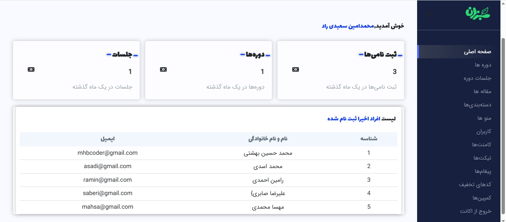
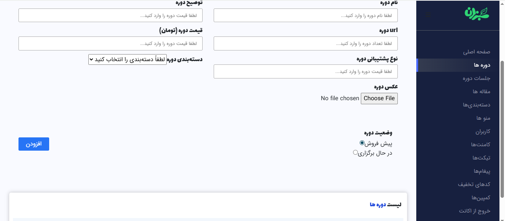
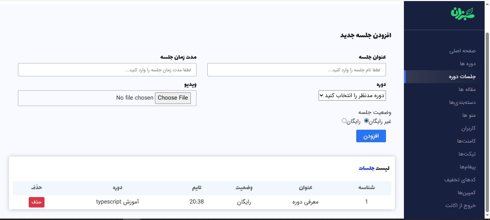

# SabzLearn Practice Frontend (CRA)

> این پروژه تمرینی است و بر اساس دوره‌ی ریکت سبزلرن ساخته شده است.

فرانت یک سایت آموزشی شبیه به سبزلرن است که من فقط ریکت آن را پیاده کرده‌ام. قالب توسط من طراحی نشده است و پروژه بک‌اند لوکال دارد؛ بدون آن داده‌ای موجود نیست و فقط بخش‌های استاتیک قابل مشاهده است.

## درباره پروژه و سازنده (SEO)

این پروژه تمرینی و آموزشی توسط **محمد حسین بهشتی زاده** انجام شده است.  
تمامی کدها توسط محمد حسین بهشتی زاده نوشته شده است.  
هدف اصلی یادگیری مفاهیم ریکت و پیاده‌سازی بخش‌های کاربر و پنل ادمین بوده است.  
این پروژه برای تمرین و تقویت مهارت‌های فرانت‌اند و ریکت طراحی شده و نشان‌دهنده توانایی‌های محمد حسین بهشتی زاده در برنامه‌نویسی وب است.

## Run:

```bash
git clone https://github.com/mohamad-bt/practice-sabzlearn-react.git
cd practice-sabzlearn-react
npm install
npm start


## screenshots






```
